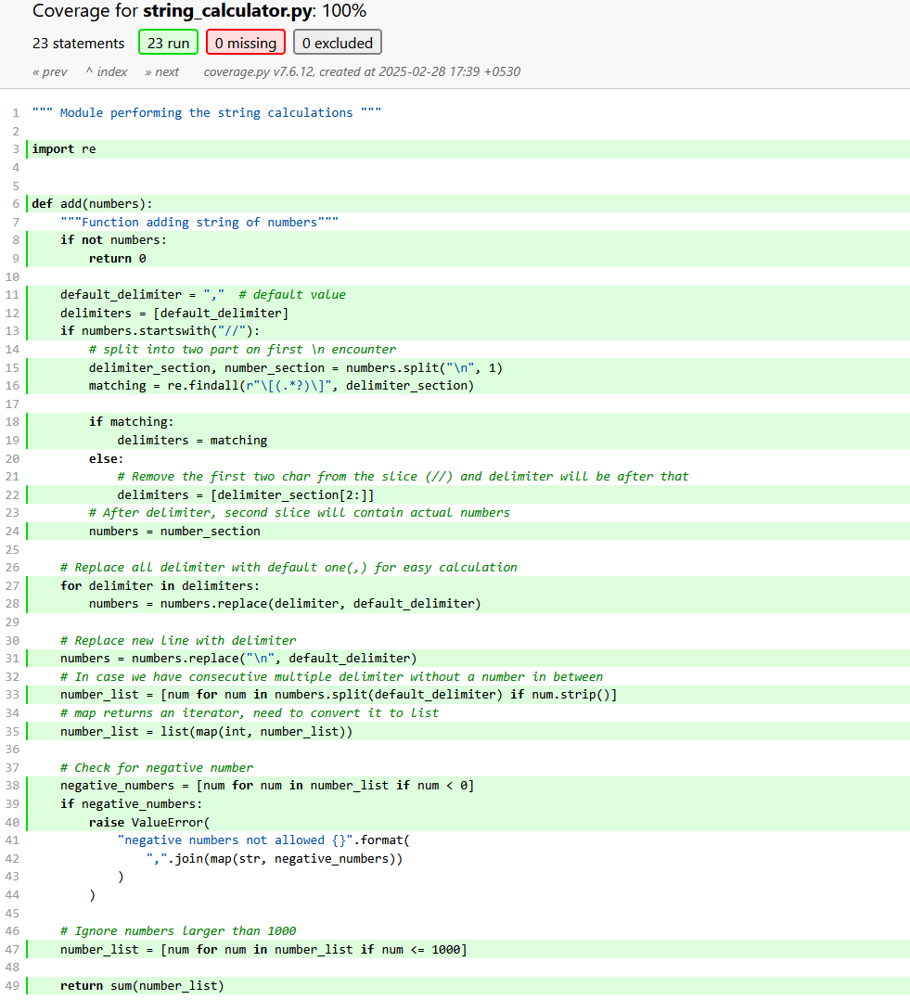

# string_calculator_tdd_kata

This project contains a module for performing string calculations and corresponding test cases. The module supports basic addition of numbers in a string, with various delimiters and special cases. It also includes test cases using `pytest` and coverage reports using `pytest-cov`

## Module: `string_calculator.py`

The `string_calculator` module provides a function `add` that performs the addition of numbers in a string. The function supports different delimiters and handles special cases such as empty strings, newlines, and negative numbers.

## Test Cases: `test_string_calculator.py`

The test cases for the add function are written using pytest. These tests cover various scenarios, including handling of different delimiters, special cases, and negative numbers.

## Running Tests

```
pytest test_string_calculator.py
```

```
=================================================== test session starts ====================================================
platform win32 -- Python 3.11.9, pytest-8.3.4, pluggy-1.5.0
rootdir: D:\Development\Python\string_calculator_tdd_kata
plugins: cov-6.0.0, anyio-4.8.0
collected 17 items                                                                                                                      

test_string_calculator.py .................                                                                                      [100%] 

==================================================== 17 passed in 0.02s =====================================================
```
## Generating Coverage Report

```
pytest --cov=string_calculator --cov-report term-missing
```
```
test_string_calculator.py .....................                                                                                                                            [100%]

---------- coverage: platform win32, python 3.11.9-final-0 -----------
Name                   Stmts   Miss  Cover   Missing
----------------------------------------------------
string_calculator.py      23      0   100%
----------------------------------------------------
TOTAL                     23      0   100%
```

In case you want to get HTML report -
```
pytest --cov=string_calculator --cov-report=html
```




## Dependencies
- pytest
- pytest-cov (if you want to use it)

Install the dependencies using pip:
```
pip install pytest pytest-cov
```
